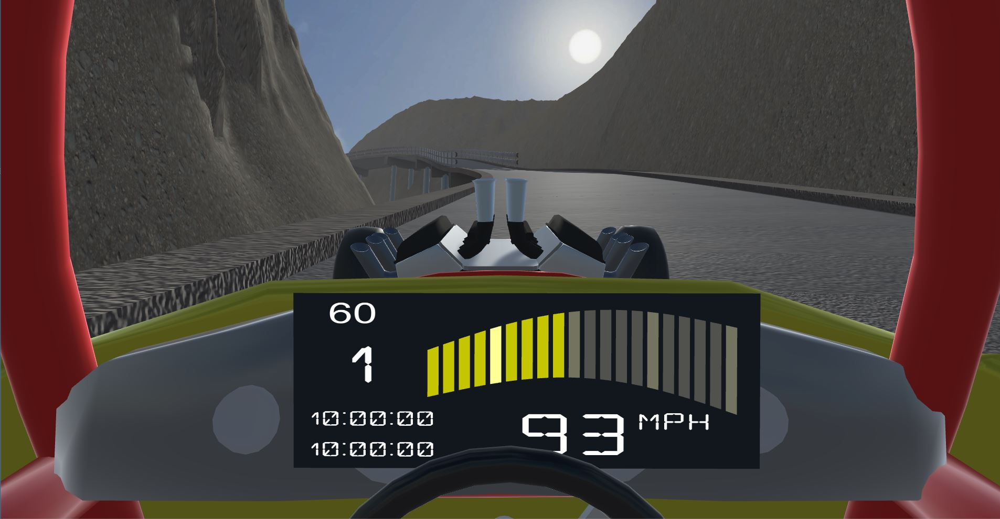

# Jump Buggy

"Jump Buggy" (for lack of a better working title) is the result of me obtaining an Oculus Go, and wanting to play something like the classic "Stunt Car Racer" in VR.

The result is a Unity3D script that warps 3D meshes around a sequence of curves to generate a smooth racing track combined with the Unity3D example car controller.

[Charles Henden](https://twitter.com/CharlesVsWorld) has contributed a very awesome car model, and the result has steadily grown into something playable.

