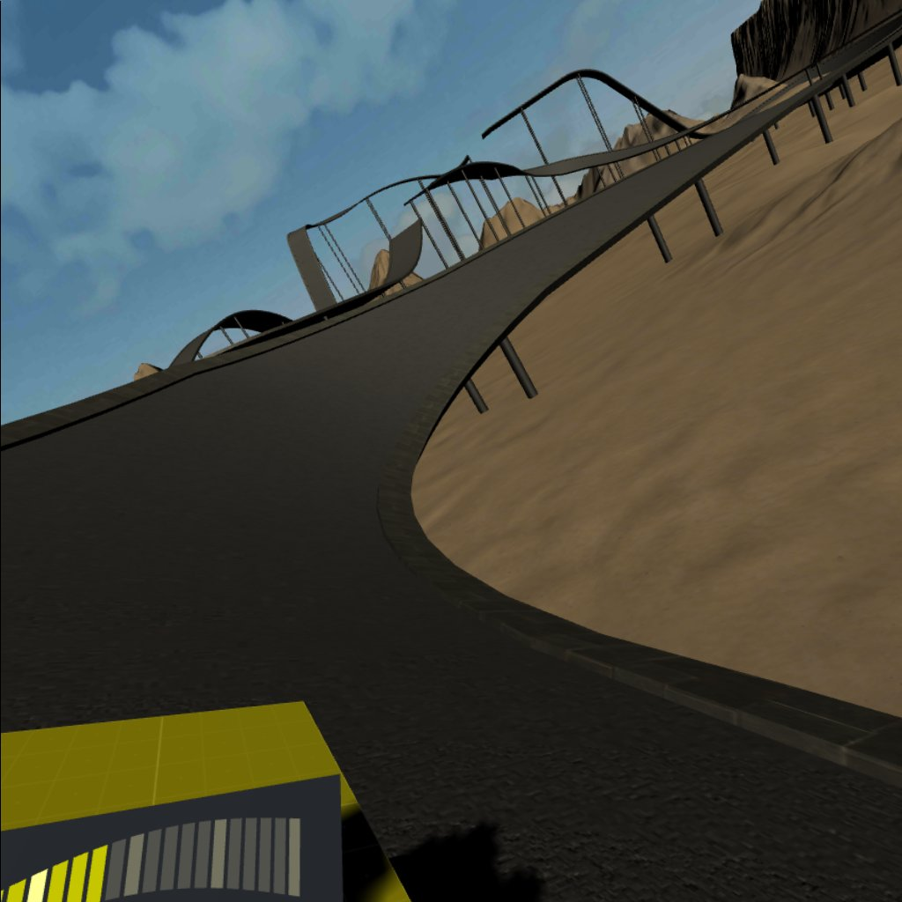
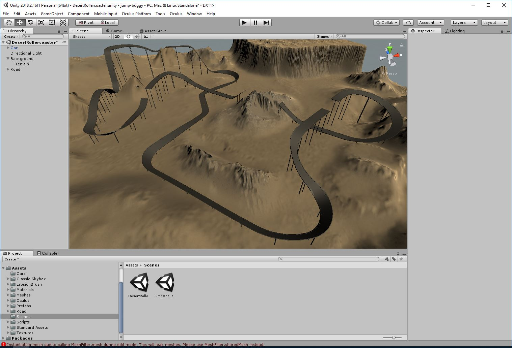

# Jump Buggy

"Jump Buggy" (for lack of a better working title) is the result of me obtaining an Oculus Go, and wanting to play something like the classic "Stunt Car Racer" in VR.

The result is a Unity3D script that warps 3D meshes around a sequence of curves to generate a smooth racing track, which combines with the Unity3D example car controller to produce gameplay not unlike the original Stunt Car Racer.

People have expressed interest in this project and building it out into something more, so I'm publishing the source here.

# Current state

Currently the game is just a tech demo. There are two tracks, each stored in a separate Unity scene (in the "Assets\Scenes" folder), which you can run to play the different tracks. Or you can build a release for the Oculus Go containing the scene you want to play in VR.

Note that there's no gameplay logic at all, so if you fall off the track, you usually have to exit and restart the game.

In theory it should also be playable on any Unity supported platform, with a little bit of work on the input code.

When running in editor, the mouse controls the car (which is nigh impossible to drive). In Oculus Go you rotate the controller to turn the steering wheel and use trigger and touchpad to accelerate or brake respectively.

# Editing the track

Each level has a single gameObject with a "CurveBasedRoad" script component. The CurveBasedRoad creates the road by duplicating a mesh and warping it around a sequence of curves. These curves are defined in the "Curves" array. Building the road involves manipulating this array in the property editor, then clicking the "Update road" button to regenerate the road meshes.

Each array entry stores:
* Length - Length in meters
* Angles - Angles around each axis in degrees. These are applied as follows:
    * X - The slope of the road. Negative is up. Positive is down. 0 is level.
    * Y - Generates corners. Negative values turn the road left. Positive right. 0 results in a straight piece of road.
    * Z - Banks the road. Negative values raise the left side of the road. Positive raise the right.
* Mesh - The mesh prefab to use. This provides the mesh that will be copied and wrapped around the road curve. Setting this to "None" creates a gap in the road, and can be used to create jumps.
* Support Index - This indexes into the "Supports" array to generate supporting poles underneath the road. Setting this to -1 results in no supporting poles.

In addition to the "Curves" array is the "Supports" array. This determines how support poles will be generated, so that the road isn't floating in the air. Each entry stores:
* Mesh - The mesh prefab to use
* Spacing - The spacing along the track, in meters.
* Horizontal spacing - How far to each side the left and right poles will be placed respectively (in meters). Setting this to 0 results in a single support pole in the center.
* Radius - The radius of the pole. This is used to prevent the top of the pole from poking through the road on steep angles.

# To do

As this is just a basic playable demo there's a mountain of things to do before this starts to resemble a playable game. These are some of the more pressing ones.

## Proper car model

Replace the "programmer art" stand-in with a decent looking model.

## Smoother track

The track collision surface is created by adding a MeshCollider to each mesh after warping it around the road curves. The initial mesh has enough polygons that it looks decent, however it can still be rough to drive on, particularly on banked corners.

Ideally the collision model should be generated from a separate mesh that matches the visible mesh, but has a higher polygon count so that the surface is smoother after warping.

## Road mesh Level Of Detail (LOD)

Create multiple LOD versions of the road meshes. Warp each one to the road curves and hook them into Unity's LOD mechanism to improve performance.
